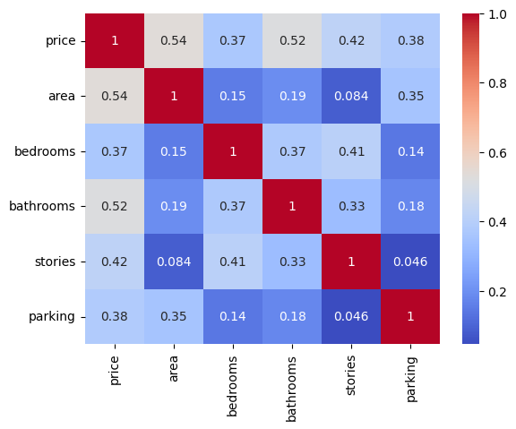
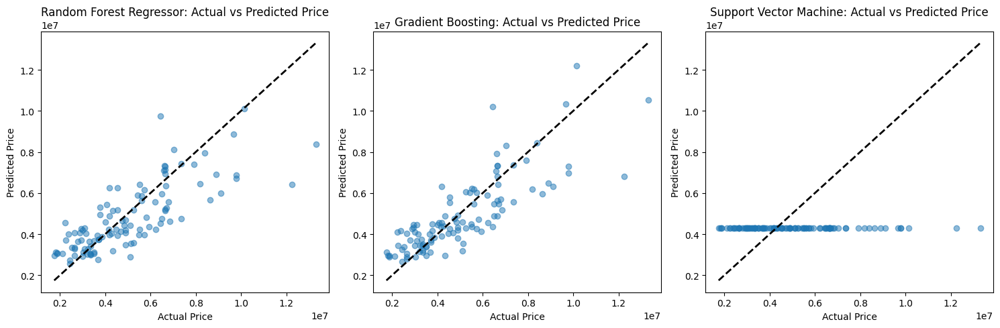

# Laporan Proyek Machine Learning: Prediksi Harga Rumah

## 1. Project Overview

### Latar Belakang
Prediksi harga rumah adalah salah satu permasalahan paling umum dan relevan dalam domain data science, khususnya di bidang real estate dan ekonomi. Dengan memanfaatkan data historis properti seperti ukuran, lokasi, dan fasilitas, kita dapat membangun model prediktif untuk memperkirakan harga rumah secara otomatis. Model semacam ini sangat berguna bagi agen properti, pembeli, pengembang, hingga lembaga keuangan untuk pengambilan keputusan.

### Pentingnya Proyek
- Membantu pengguna dalam menentukan harga jual/beli properti yang wajar.
- Memberi nilai tambah bagi layanan pencarian properti online.
- Meningkatkan efisiensi evaluasi kredit atau hipotek melalui estimasi harga otomatis.

## 2. Business Understanding

### Problem Statements
- *Bagaimana cara memperkirakan harga rumah berdasarkan fitur-fitur properti seperti ukuran, jumlah kamar, atau fasilitas yang dimiliki?*
- *Model apa yang paling mampu memberikan prediksi akurat pada data numerik dan kategorikal campuran?*

### Goals
- Mengembangkan model regresi untuk memprediksi harga rumah berdasarkan fitur properti yang tersedia.
- Menganalisis dan membandingkan beberapa model regresi seperti Random Forest, Gradient Boosting, dan Support Vector Regressor.
- Menilai performa model menggunakan metrik regresi seperti RMSE dan R² Score.

### Solution Statement
- Melakukan preprocessing data meliputi encoding variabel kategorikal dan scaling numerik.
- Membagi dataset ke dalam data pelatihan dan pengujian.
- Membangun dan melatih beberapa model regresi (Random Forest, Gradient Boosting, SVR).
- Mengevaluasi performa model pada data pengujian menggunakan metrik evaluasi standar.

## 3. Data Understanding

### Sumber Dataset
Dataset berasal dari [Kaggle: Housing Prices Dataset](https://www.kaggle.com/datasets/yasserh/housing-prices-dataset).

### Deskripsi Dataset
- Total kolom: 12 fitur (mix numerik dan kategorikal), termasuk:
  - `area`, `bedrooms`, `bathrooms`
  - `mainroad`, `guestroom`, `basement`, `hotwaterheating`, `airconditioning`, `prefarea` (kategorikal: yes/no)
  - `furnishingstatus`: status perabotan
  - `price`: target/label (harga rumah)

### EDA (Exploratory Data Analysis)
- Visualisasi distribusi numerik dilakukan dengan histogram.
- Korelasi antar fitur numerik divisualisasikan menggunakan heatmap.
- Insight awal menunjukkan fitur seperti `area` dan `bathrooms` memiliki korelasi paling tinggi terhadap `price`.

 

## 4. Data Preparation

### Langkah-langkah
- Encoding variabel kategorikal (`LabelEncoder`) untuk mengubah data `yes/no` menjadi numerik.
- Normalisasi fitur menggunakan `MinMaxScaler`.
- Pembagian data:
  - 80% data pelatihan (`x_train`, `y_train`)
  - 20% data pengujian (`x_test`, `y_test`)

```python
x = df.drop('price', axis=1)
y = df['price']
x_train, x_test, y_train, y_test = train_test_split(x, y, test_size=0.2)
```

## 5. Modeling and Result

### Model yang Dibandingkan
1. **Random Forest Regressor**
2. **Gradient Boosting Regressor**
3. **Support Vector Regressor (SVR)**

### Evaluasi Model
- Metrik evaluasi:
  - RMSE (Root Mean Squared Error)
  - R² Score (koefisien determinasi)

```python
results = {
  'Random Forest Regressor': evaluate_model(rfr, x_test, y_test),
  'Gradient Boosting': evaluate_model(gbr, x_test, y_test),
  'Support Vector Machine': evaluate_model(svr, x_test, y_test)
}
```

### Hasil Ringkasan
- Hasil ditampilkan dalam tabel ringkasan performa model.
- Random Forest dan Gradient Boosting menunjukkan performa terbaik.

## 6. Evaluation

### Metrik yang Digunakan

- **RMSE** = $$\sqrt{ \frac{1}{n} \sum_{i=1}^{n} (y_i - \hat{y}_i)^2 }$$

- **R² Score**:
Mengukur proporsi variasi harga rumah yang berhasil dijelaskan oleh model.

### Hasil Evaluasi
| Model                   | RMSE          | R² Score |
|-------------------------|--------------|----------|
| Random Forest Regressor | 1.423532e+06 | 0.599087 |
| Gradient Boosting       | 1.302954e+06 | 0.664128 |
| Support Vector Machine  | 2.359647e+06 | -0.101564 |

  

## Kesimpulan
- Model regresi berbasis Random Forest dan Gradient Boosting memberikan performa terbaik dalam memprediksi harga rumah, dengan nilai RMSE dan R² yang cukup rendah.
- Model Support Vector Machine memiliki performa yang lebih buruk dengan nilai RMSE yang palingi tingg dan nilai R² yang mencapai negatif, menunjukkan model tidak dapat menangkap pola dalam data.
- Hasil inferensi menunjukkan model SVM unggul dikarenakan seluruh persebaran prediksi harga tetap pada angka `4.290984e+06`.
